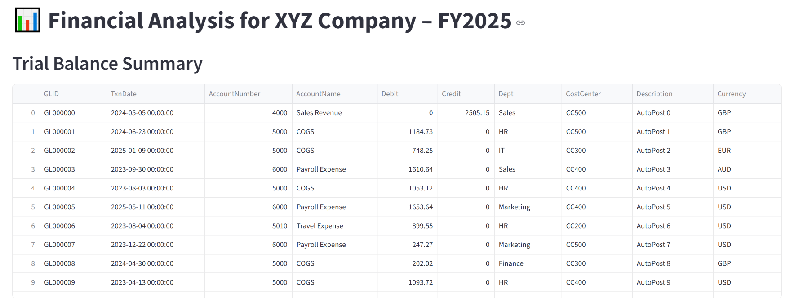
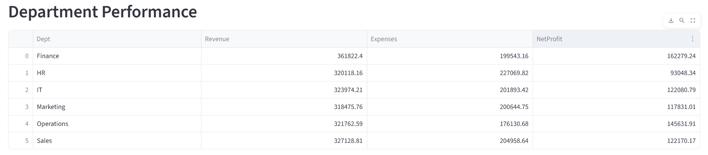
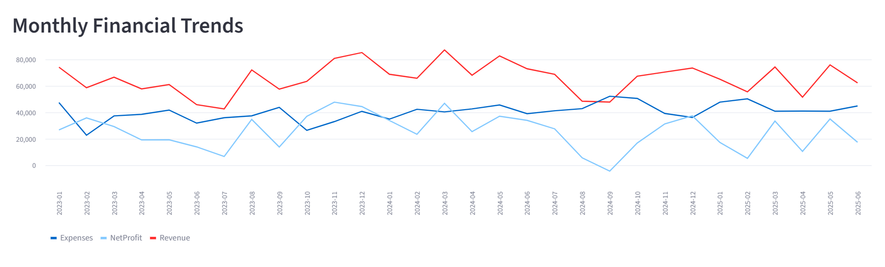
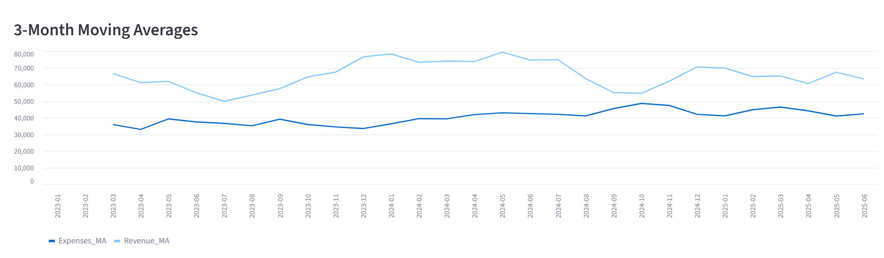
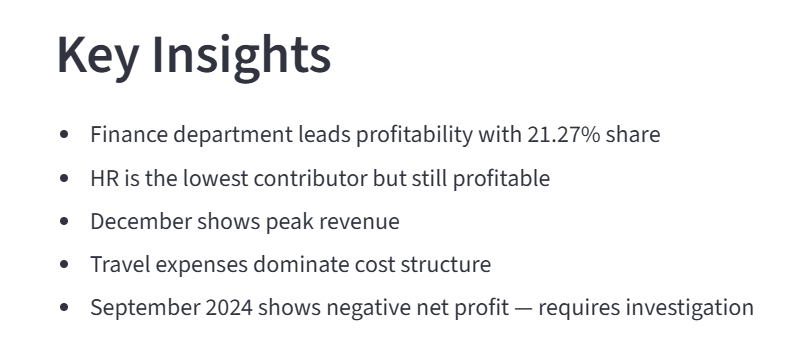

# 📊 Financial Dashboard for XYZ Company – FY2025

This project delivers a streamlined financial analytics dashboard built with Streamlit, Pandas, and Matplotlib. It reads a general-ledger-style Excel file, computes department performance, monthly trends, and expense breakdowns, and presents clear visuals plus concise insights.

---

## 📁 Project structure

    ├── dashboard.py                        # Streamlit app
    ├── financial_analysis_fy2025.xlsx      # Raw Excel data
    ├── financial_analysis_notebook.ipynb   # Jupyter analysis (optional but recommended)
    ├── requirements.txt                    # Dependencies
    └── images/                             # Screenshots for documentation
        ├── trial_balance_summary.png
        ├── department_performance.png
        ├── monthly_financial_trends.png
        ├── month_moving_averages.png
        └── key_insights.png

---

## 🚀 Run locally

- **Install dependencies:**
    
        pip install -r requirements.txt

- **Start the app:**
    
        streamlit run dashboard.py

- **Open in browser:** Streamlit will show a local URL in the terminal (typically http://localhost:8501).  
- **Excel file:** The app expects the file name: `financial_analysis_fy2025.xlsx` in the project root.

---

## 📸 Dashboard previews

### Trial Balance Summary

### Department Performance

### Monthly Financial Trends

### 3‑Month Moving Averages

### Key Insights

---

## 💡 Key insights

- Finance department leads profitability with 21.27% share.
- HR is the lowest contributor but remains profitable.
- December shows peak revenue.
- Travel expenses dominate the cost structure.
- September 2024 shows negative net profit — requires investigation.

---

## 🛠️ Technologies used

- Python 3.10+
- Streamlit
- Pandas
- Matplotlib
- openpyxl
